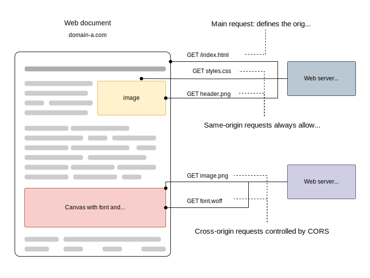

# CORS (Cross-Origin Resource Sharing)

(다른 출처의 자원의 공유에 대한 정책)


HTTP-header based mechanism that allows a server to indicate any origins (domain, scheme, or port)
which a browser should permit loading resources.

<br>

### preflight request 

실제 요청 전 서버와 잘 통신할 수 있는지 확인 요청

OPTIONS 메서드로 몇가지 헤더를 통해 확인 절차를 밟게 됨

<br>
CORS also relies on a mechanism by which browsers make a "preflight" request to the server hosting the cross-origin resource


### 📌 An example of a cross-origin request

`https://domain-a.com` **-->** `https://domain-b.com`

```
fetch('https://domain-b.com/data.json') 
...
```




