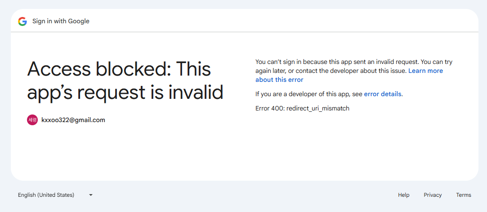

# Google OAuth API

## 1️⃣ Access blocked (`localhost:8090/oauth2/authorization/google`)

I encountered this error when I clicked Google login button for test in server (local server)

### ⚠️ Error Log

```
Access blocked: This app’s request is invalid
```

### 🧾 Cause

Google Cloud Console settings is invalid
<br>
I wrote a wrong port number

### ⚡ Solution

1. Check Google Cloud Console settings
    - Spring Boot Server Redirection URL (승인된 리디렉션 URI)

<br>

## 2️⃣ Access blocked (`https://planmytodos-api-production.up.railway.app/oauth2/authorization/google`)

I encoutered this error when I clicked Google login button in real server (railway server)

### ⚠️ Error Log
```
Access blocked: This app’s request is invalid

Error 400: redirect_uri_mismatch

앱이 Google의 OAuth 2.0 정책을 준수하지 않기 때문에 앱에 로그인할 수 없습니다.

앱 개발자라면 Google Cloud Console에서 리디렉션 URI를 등록하세요.
Request details: redirect_uri=http://planmytodos-api-production.up.railway.app/login/oauth2/code/google flowName=GeneralOAuthFlow
```



### 🧾 Cause

I requested url https on client
<br>
When a spring boot is deployed behind a reverse proxy, 
it can mistakenly assume that client requests are coming in over HTTP by default
<br>
PaaS like Railway usually process http requests by using a load balancer(or proxy)
However, Spring boot basically tries to recognize the direct protocol used by the client

### ⚡ Solution

Configure the settings so that the proxy recognizes the actual requests as HTTPS

```
//application.properties

server.forward-headers-strategy=native
```

## 3️⃣ Unauthorized in real server (railway & netlify)

I encountered this issue when I tested google oauth login after deployment in real server 

### ⚠️ Error Log

```
GET https://planmytodos-api-production.up.railway.app/user/me net::ERR_ABORTED 401 (Unauthorized)
```

F12 -> Network -> Set-Cookie: `JSESSIONID=.....; Path=/; Secure; HttpOnly`

### 🧾 Cause
Client Domain and Server Domain are different, so basically cookie couldn't share.

### ⚡ Solution

Configure cookie settings in server

```
//application.properties

server.servlet.session.cookie.same-site=none
server.servlet.session.cookie.secure=true
```