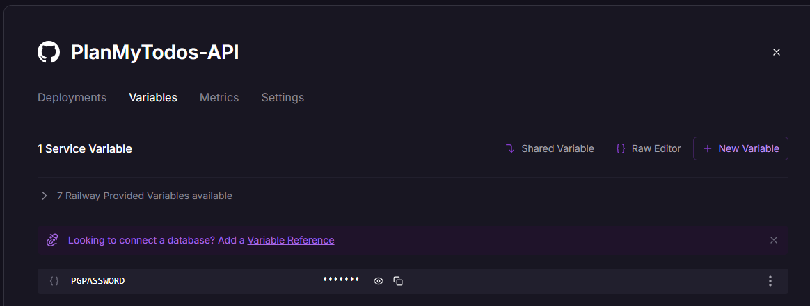
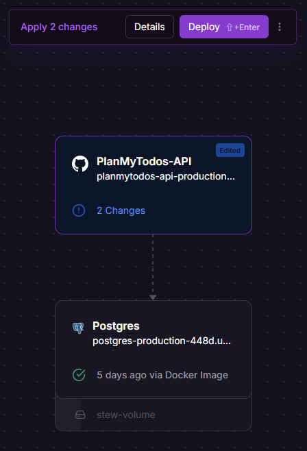
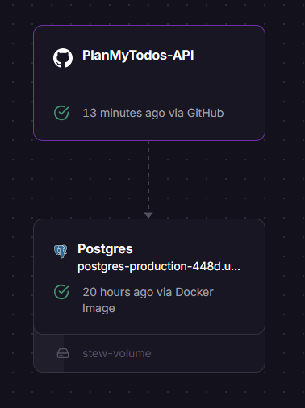

# Deploy to Railway & Environment Setup

While Deploying to Railway, I encountered some troubleshooting issues.

## 1️⃣ Incorrect DB Info 

### ⚠️ Error Log
```
Caused by: java.lang.RuntimeException: Driver org.postgresql.Driver claims to not accept jdbcUrl, ${DB_URL}

Error creating bean with name 'entityManagerFactory' defined in class path resource [org/springframework/boot/autoconfigure/orm/jpa/HibernateJpaConfiguration.class]: [PersistenceUnit: default] Unable to build Hibernate SessionFactory; nested exception is java.lang.RuntimeException: Driver org.postgresql.Driver claims to not accept jdbcUrl, ${DB_URL}
```

### 🧾 Cause
I had configured incorrect database connection details in the `application.properties` file, likely by not using the Railway-provided database URL.
<!-- <br><br>
(railway 의 db를 사용하지 않고 잘못된 정보를 기입함.) -->

### ⚡ Solution
1. Create a Database deployment (PostgreSQL) on Railway
2. Update the database connection information in the `application.properties` file as follows:
    ```
    spring.datasource.url=jdbc:postgresql://${PGHOST}:${PGPORT}/${PGDATABASE}
    spring.datasource.username=${POSTGRES_USER}
    spring.datasource.password=${POSTGRES_PASSWORD}
    ```

<br>
<br>

## 2️⃣ Hibernate cannot connect DB

### ⚠️ Error Log
```
Error creating bean with name 'entityManagerFactory' defined in class path resource [org/springframework/boot/autoconfigure/orm/jpa/HibernateJpaConfiguration.class]: [PersistenceUnit: default] Unable to build Hibernate SessionFactory; nested exception is java.lang.RuntimeException: Driver org.postgresql.Driver claims to not accept jdbcUrl, jdbc:postgresql://${PGHOST}:${PGPORT}/${PGDATABASE}
```

### 🧾 Cause

The server created an incorrect JDBC URL because it could not load the Variables.
<br> Consequently, Hibernate failed to connect to the database.

### ⚡ Solution

Modify the jdbc URL as follows:
```
jdbc:postgresql://metro.proxy.rlwy.net:55672/railway
```


<hr>

### ⚠️ Error Log
```
org.hibernate.exception.GenericJDBCException: unable to obtain isolated JDBC connection [FATAL: password authentication failed for user "postgres"] [n/a]

Error creating bean with name 'entityManagerFactory' defined in class path resource [org/springframework/boot/autoconfigure/orm/jpa/HibernateJpaConfiguration.class]: [PersistenceUnit: default] Unable to build Hibernate SessionFactory; nested exception is org.hibernate.exception.GenericJDBCException: Unable to open JDBC Connection for DDL execution [FATAL: password authentication failed for user "postgres"]
```

### 🧾 Cause

The database password was incorrect because the server couldn't load the environment variable from Railway.
<br>
When I tested the connection using the actual password value, it worked fine.

### ⚡ Solution

I needed to properly set up the database environment variable in the Backend Railway deployment. 

1. Update application.properties to use an environment variables.
    ```
    #application.properties

    spring.datasource.password=${PGPASSWORD}
    ```

<br>

2. In Railway, pass the environment variable from the Postgres deployment to the Backend deployment: <br>
    

<br>

3. After setting the variable, a `Deploy` button will appear on the Backend deployment. Click it to redeploy.
    
   
<br>

5. All Done <br>
    

<br>
<br>

Also, I created a `.env` file in the root folder directory of my local server and added the following configuration to connect to the Railway Postgres server :

```
#application.propertise

spring.config.import=optional:file:.env[.properties]
```
